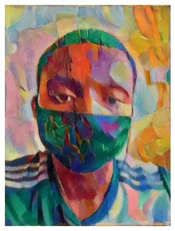

# Neural Style Transfer

An implementation of neural style transfer, inspired by an assignment in the [Introduction to Deep Learning with Pytorch](https://www.udacity.com/course/deep-learning-pytorch--ud188) course on Udacity.  
The VGG19 model pretrained on the imagenet dataset was used as the feature extractor.

